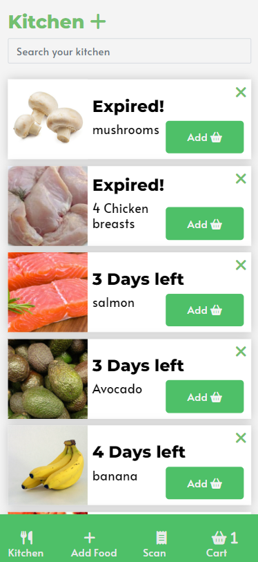

# FreshOut

Mobile first web site that helps in food wasting prevention with an inventory system.

 


## How to run
### Setup

Install gems
```
bundle install
```
Install JS packages
```
yarn install
```

### ENV Variables
Create `.env` file
```
touch .env
```
Inside `.env`, set these variables. For any APIs, see group Slack channel.
```
CLOUDINARY_URL=YOUR_KEY
EDAMAM_APP_ID =YOUR_ID
EDAMAM_APP_KEY =YOUR_KEY
GOOGLE_APPLICATION_CREDENTIALS =YOUR_CREDENTIALS
```

### DB Setup
```
rails db:create
rails db:migrate
rails db:seed
```

### Run a server
```
rails s
```

<br>
